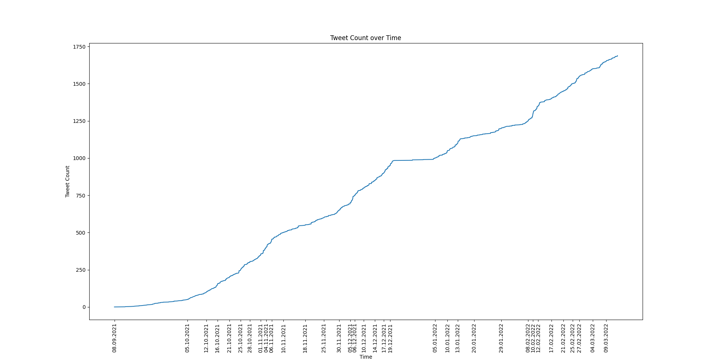
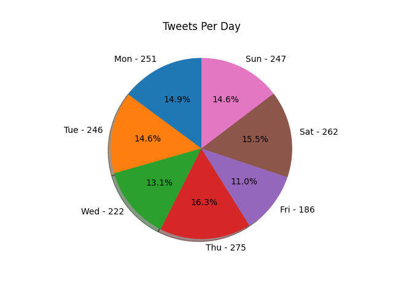
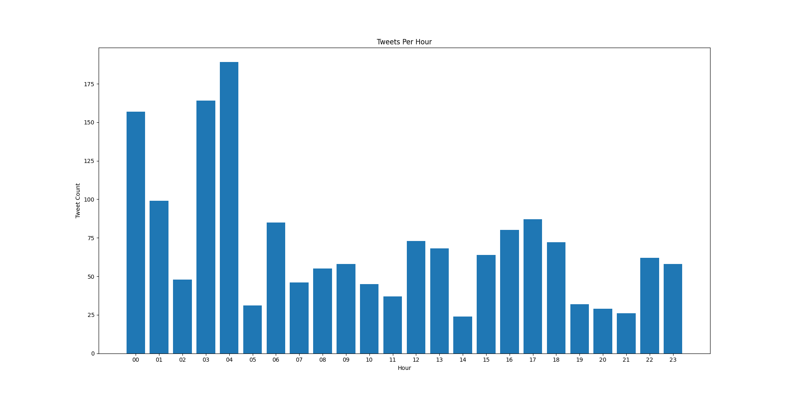

# tweet-graph
Small python script to plot tweet count 

# Dependencies
- [matplotlib](https://matplotlib.org/) - ```pip install matplotlib```

# Quickstart
- Download your archive from [Twitter](https://twitter.com/settings/download_your_data)
- Unzip the archive, and move data/tweet.js to the same directory as this script
- Replace first line of tweet.js with ```[``` 
- Run ```./plot.py```

# Examples





